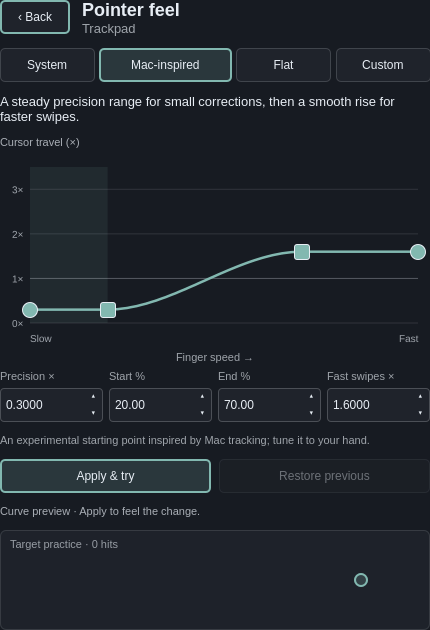

# Trackpad Plus for Omarchy

**Make your trackpad feel right.**

Fine-grained, per-device trackpad controls and pointer-feel tuning for
[Omarchy](https://omarchy.org). Independently maintained by David Fano;
not an official Omarchy project or endorsed by the Omarchy team.

## Project history

Trackpad Plus for Omarchy began as a fork of Andrew Kent’s
[omarchy-touchpad-widget](https://github.com/awkent01/omarchy-touchpad-widget).
It is independently maintained and has expanded to include per-device
controls, Apple trackpad support, and advanced pointer-feel tuning.
The original project and this derivative are licensed under the MIT License.

## Controls

- Enable or disable the selected trackpad.
- Scroll speed (0.01–2.00×, in 0.01 steps) and pointer speed (−1.0–1.0).
- Pointer feel: System (adaptive), Flat, Mac-inspired, and Custom profiles.
- Visual acceleration editor with draggable precision, acceleration start/end, and fast-swipe
  handles, keyboard adjustment, target practice, and Restore previous.
- Natural scrolling, tap to click, disable while typing, and clickfinger behavior.
- Keyboard navigation through device selection, sliders, and switches.

The built-in Apple Silicon trackpad (`apple-mtp-multi-touch`) and Apple Magic
Trackpad interfaces share one set of Apple settings. The known
Dell touchpad is labeled Dell; other devices containing `touchpad` or `trackpad`
in their Hyprland name are listed by that name. Disconnected devices retain their
saved settings, and newly attached devices are discovered during state refreshes.

## Tuning pointer feel



Open **Pointer feel**, choose **Mac-inspired** as a starting point, then use
**Apply & try** and the target practice area. Drag the left handle vertically to
adjust precision and the right circle vertically to adjust fast swipes. Move the
two square handles horizontally to independently set where acceleration starts
and where it reaches full speed. Each value also has an editable number spinner:
click the number and press Up/Down, click its small arrow buttons, or type a value
and press Enter. Gain steps are 0.001×; threshold steps are one percentage point.
Hold Shift with ↑/↓ for 10× larger steps: 0.01× gain or 10 percentage points.
Typed values allow four decimal places for gain and two for percentages.
Apply also commits any typed value before sending the curve.
The shaded region holds a steady low gain for
fine corrections. Start/end handles move in small fixed increments. Tab between
controls; arrow keys adjust a focused handle. Escape returns to the main panel.
Edits preview the graph until Apply is pressed. Restore previous swaps back to
the profile used before the last Apply on that device, including after a restart.
Applied profiles persist across shell restarts and Hyprland reloads.

The graph shows finger speed versus cursor travel multiplier (gain). The editor
converts this to 41 evenly spaced output-velocity samples for libinput's native
custom profile, and plots the response interpolated from those same samples.
The backend validates each custom curve with the installed libinput library
before applying or saving it. Libinput accepts at most 64 points; Hyprland 0.56
does not report its point-validation failures through `hyprctl eval`, so checking
the compositor response alone is insufficient. The editor uses 41 points.
The fast end has constant gain so extrapolation does not keep increasing it.
The horizontal scale is relative, not calibrated physical finger speed.

The Mac-inspired starting preset uses 0.30× precision, acceleration starting at
20% of the graph and ending at 70%, and 1.60× fast-swipe travel. Existing
three-handle curves preserve their intended shape during migration and appear as Custom.

The Mac-inspired preset is an experimental approximation, not a measured copy of
macOS. Hardware, display scaling, and personal preference affect the result.
Scrolling remains a separate speed/direction control; this editor does not add
scroll momentum or change gestures or haptic feedback. Custom profiles use an
explicit identity scroll curve before the existing scroll multiplier.

Pointer Speed is shown for System and Flat. Libinput ignores that speed setting
in custom mode, so the custom curve controls replace it. Its saved value is
retained when returning to System or Flat. The System preset explicitly selects
libinput adaptive acceleration with that saved speed.

## Install and upgrade

Requires Omarchy's Quickshell shell and Lua-based Hyprland configuration
(tested with Hyprland 0.56.2), Python 3, libinput with custom acceleration support
(`libinput.so.10`), `hyprctl`, and GNU `timeout` (coreutils). No elevated privileges
are required. Older Hyprland configurations using `.conf` syntax are unsupported.

```sh
omarchy plugin add https://github.com/davefano/omarchy-trackpad-plus.git --enable
```

For an unattended installation, append `--yes`. The plugin ID is
`davefano.trackpad-plus`. Settings initialize automatically on the first state
read. The widget appears when a supported trackpad is detected or remembered.

To upgrade an installed Git-managed copy:

```sh
omarchy plugin update davefano.trackpad-plus
omarchy restart shell
```

Back up local plugin edits before updating; develop in a separate checkout.

## Migrate from the original widget or local customization

The old IDs are `awkent01.touchpad` and `local.touchpads`. Keep only one trackpad
plugin enabled. First back up the installed plugin, shell layout, and state:

```sh
old_id=awkent01.touchpad  # Use local.touchpads for the earlier customization.
trackpad_backup="$HOME/.local/state/omarchy/backups/trackpad-plus-$(date +%Y%m%d-%H%M%S)"
mkdir -p "$trackpad_backup"
cp -a "$HOME/.config/omarchy/plugins/$old_id" "$trackpad_backup/"
cp -a "$HOME/.config/omarchy/shell.json" "$trackpad_backup/shell.json"
trackpad_state="${XDG_STATE_HOME:-$HOME/.local/state}/omarchy"
if test -d "$trackpad_state/local-touchpads"; then
  cp -a "$trackpad_state/local-touchpads" "$trackpad_backup/"
fi
if test -d "$trackpad_state/toggles/hypr"; then
  cp -a "$trackpad_state/toggles/hypr" "$trackpad_backup/hypr-toggles"
fi
omarchy plugin add https://github.com/davefano/omarchy-trackpad-plus.git --yes
omarchy plugin disable "$old_id"
omarchy plugin enable davefano.trackpad-plus --section right
omarchy restart shell
hyprctl reload
hyprctl configerrors
```

The old plugin remains installed for rollback. Do **not** delete the existing
state or generated Lua during migration. Trackpad Plus uses the same
`local-touchpads/settings.json` and `toggles/hypr/zz-local-touchpads.lua` paths,
including per-device curves and Restore previous. Recognized legacy per-device
sensitivity rules in `touchpad-settings.lua` are imported on first initialization.
Other device values initially inherit global touchpad defaults; arbitrary edits
from other configuration tools are not imported.

Update any keybindings or scripts that use the old IPC target. To roll back
without changing your current trackpad values:

```sh
omarchy plugin disable davefano.trackpad-plus
omarchy plugin enable "$old_id" --section right
omarchy restart shell
hyprctl reload
hyprctl configerrors
```

For an exact pre-migration restore, disable both plugins, restore the backed-up
plugin and `shell.json`, and copy the backed-up `local-touchpads` and
`hypr-toggles` files back to their original locations before restarting the shell
and reloading Hyprland. This also restores settings you changed after migration.
Keep the backup path printed by `echo "$trackpad_backup"`.

## IPC

```sh
omarchy-shell davefano.trackpad-plus open
omarchy-shell davefano.trackpad-plus close
omarchy-shell davefano.trackpad-plus toggle
omarchy-shell davefano.trackpad-plus show
omarchy-shell davefano.trackpad-plus hide
```

## Persistence and process behavior

Settings live under `$XDG_STATE_HOME` (default `~/.local/state`):

- `omarchy/local-touchpads/settings.json`: per-device values and previous profile.
- `omarchy/toggles/hypr/zz-local-touchpads.lua`: literal per-device rules loaded
  by Omarchy on Hyprland reload.

The historical filenames are intentional compatibility interfaces, independent
of the plugin ID. `trackpads.py` serializes operations with a file lock and
atomically replaces each file. The two files are not one filesystem transaction;
on a reported save failure the helper attempts to restore the previous rules.
On the next state read, missing or inconsistent generated rules are rebuilt and
applied from the saved JSON, which remains authoritative.

State reads have a 15-second deadline; writes have 10 seconds, followed by a
2-second forced-kill deadline. Timed-out actions release the queue and report an
error. Stale poll results are discarded after newer edits. The panel shows saved
settings; external configuration changes are not automatically imported.

## Development and testing

See [DEVELOPMENT.md](DEVELOPMENT.md) for the complete suite, architecture, and
live verification checklist. Report bugs through
[GitHub Issues](https://github.com/davefano/omarchy-trackpad-plus/issues).

## Removal

```sh
omarchy plugin remove davefano.trackpad-plus
```

Removal preserves settings and generated device rules. To stop applying those
rules while retaining a recoverable copy, move `zz-local-touchpads.lua` outside
the `toggles/hypr` directory and run `hyprctl reload`. Keep `settings.json` to
reuse your values on reinstall. Remove it only if you want fresh defaults.

## License

[MIT](LICENSE). Copyright 2026 Andrew Kent and David Fano. The complete original
commit history and Andrew Kent's copyright notice are preserved.
